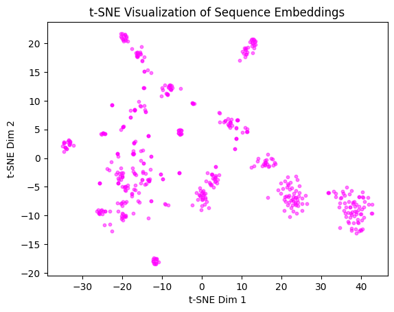

```python
import numpy as np 
import matplotlib.pyplot as plt 
from sklearn.manifold import TSNE
from sklearn.cluster import KMeans, DBSCAN, AgglomerativeClustering

```


```python
emb = np.loadtxt("embeddings.txt")
tsne = TSNE(n_components=2, perplexity=30, learning_rate=200)
embedding_2d = tsne.fit_transform(emb)
plt.scatter(embedding_2d[:, 0], embedding_2d[:, 1], s=10, alpha=0.5, c="#ff00ff")
plt.title("t-SNE Visualization of Sequence Embeddings")
plt.xlabel("t-SNE Dim 1")
plt.ylabel("t-SNE Dim 2")
plt.show()
```


    

    


```python

```
